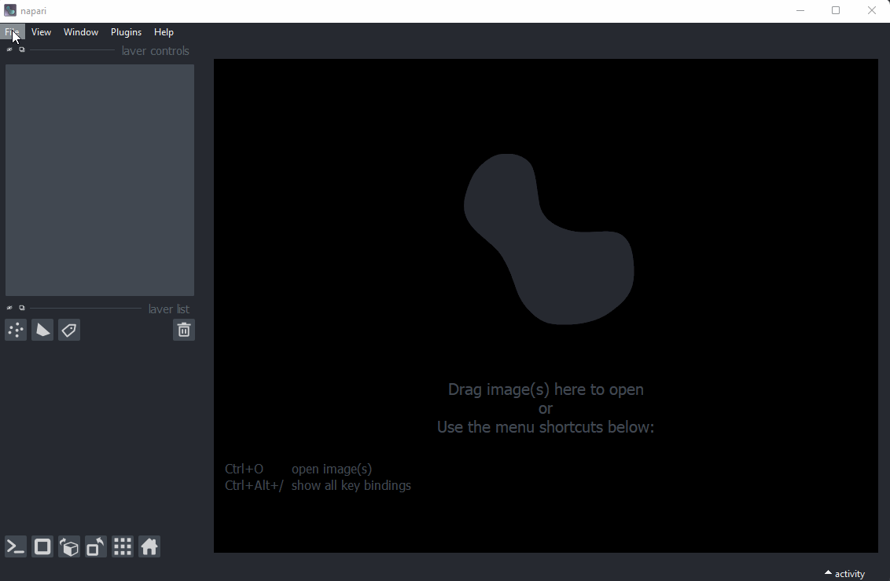

# napari-bleach-correct

## Bleach correction for napari

This plugin is a python implementation of three different algorithms for bleach correction and can be used 
to correct time-lapse images that lose intensity due to photobleaching. The implementation is based on the ImageJ 
plugin Bleach Corrector by Miura et al. All methods work with 2D and 3D time series.

Napari Bleach correction is easy to use:

### Ratio Method

This is the simplest method. Every pixel in a frame is multiplied by the ratio from the mean intensity of the 
first frame to that of the *i-th* frame.

Assumptions:
* the mean intensity (*I bar*) is constant through the time-lapse
* the background fluorescence is the same for every pixel and *i-th* frame

Parameters:
* Background Intensity: Must be estimated

### Exponential Curve Fitting

Drift estimation of fluorescence signal by fitting the mean intensity to an exponential curve.
The image is corrected by the decay in the normalized exponential function.

Assumptions:
* time intervals between frames are equal

Parameters:
* Exponential Curve: Bleaching can be modelled as a mono- or bi-exponential curve

Mono-exponential function:

Bi-exponential function:

### Histogram Matching

Bleaching correction by matching histograms to a reference image.
The correct pixel values can be calculated by the cumulative distribution function
of a frame and its reference frame. This method introduced by Miura et al.

Parameters:
* Reference Frame: Match the frame's histogram with the first our neighbor frame 

The Histogram Matching method using the neighbor frame as reference is a good start to correct bleaching.

## References

* Miura K. [Bleach correction ImageJ plugin for compensating the photobleaching of time-lapse sequences.](https://www.ncbi.nlm.nih.gov/pmc/articles/PMC7871415/) F1000Res. 2020 Dec 21;9:1494. doi: 10.12688/f1000research.27171.1
* [Documentation of the ImageJ plugin](https://wiki.cmci.info/downloads/bleach_corrector)
----------------------------------

This [napari] plugin was generated with [Cookiecutter] using [@napari]'s [cookiecutter-napari-plugin] template.

<!--
Don't miss the full getting started guide to set up your new package:
https://github.com/napari/cookiecutter-napari-plugin#getting-started

and review the napari docs for plugin developers:
https://napari.org/plugins/stable/index.html
-->

## Installation

You can install `napari-bleach-correct` via [pip]:

    pip install napari-bleach-correct

To install latest development version :

    pip install git+https://github.com/marx-alex/napari-bleach-correct.git

## Contributing

Contributions are very welcome. Tests can be run with [tox], please ensure
the coverage at least stays the same before you submit a pull request.

## License

Distributed under the terms of the [MIT] license,
"napari-bleach-correct" is free and open source software

## Issues

If you encounter any problems, please [file an issue] along with a detailed description.

[napari]: https://github.com/napari/napari
[Cookiecutter]: https://github.com/audreyr/cookiecutter
[@napari]: https://github.com/napari
[MIT]: http://opensource.org/licenses/MIT
[BSD-3]: http://opensource.org/licenses/BSD-3-Clause
[GNU GPL v3.0]: http://www.gnu.org/licenses/gpl-3.0.txt
[GNU LGPL v3.0]: http://www.gnu.org/licenses/lgpl-3.0.txt
[Apache Software License 2.0]: http://www.apache.org/licenses/LICENSE-2.0
[Mozilla Public License 2.0]: https://www.mozilla.org/media/MPL/2.0/index.txt
[cookiecutter-napari-plugin]: https://github.com/napari/cookiecutter-napari-plugin

[file an issue]: https://github.com/marx-alex/napari-bleach-correct/issues

[napari]: https://github.com/napari/napari
[tox]: https://tox.readthedocs.io/en/latest/
[pip]: https://pypi.org/project/pip/
[PyPI]: https://pypi.org/
